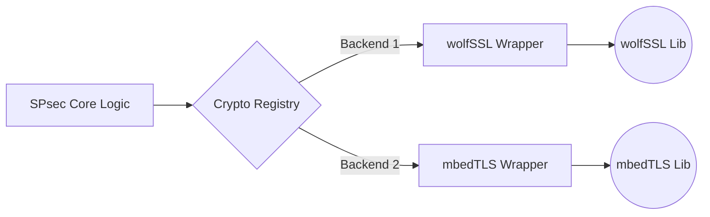

# Common Utilities

This repository contains shared utilities, cryptographic backend abstractions, and core protocol structures used throughout the SPsec project.

## Crypto Abstraction Architecture

SPsec is designed to be library-agnostic. The abstraction dynamically maps the SPsec required cryptographic primitives to the active backend.

## Key Components

### 1. Key Management
SPsec requires structured management of various pre-shared keys. The `keys.c` utilities securely parse, store, and manipulate the hierarchy of keys:
- **Provisioning & Integrator Keys**: Highest priority keys for factory installation or initial network power-up.
- **Seed & Communication Keys**: Grouping keys where the Communication key is actively rolled (derived) from the Seed key based on timers or counters.
- **Session Keys**: Ephemeral keys used during 1:1 mutual authentication handshakes.

### 2. Uniqueness Values
To prevent replay attacks—a critical vulnerability in statically mapped small-packet networks—SPsec introduces Uniqueness Values.
The utilities manage these counters (used in 1:1 sessions) or synchronized timers (used for secure grouping) and append them securely during the cryptographic hashing phase.

### 3. Protocol Messaging Serialization
Core logic for converting raw structs into byte-streams appropriate for the network, supporting:
- **Handshakes**: Framing the Hello and Finished stages used to derive and confirm Session Keys (`messages_handshake.c`).
- **Register Operations**: Abstracting dynamic configuration reads and writes (`messages_register.c`).
- **Session Frames**: Preparing the Data Plane payloads for the physical transport layer (`messages_session.c`).

### 4. Cryptographic Primitives Wrapper
Files like `crypto_backend_wolfssl.c` and `crypto_backend_mbedtls.c` wrap the underlying library calls, enforcing SPsec constraints like the requirement for a True Random Number Generator (TRNG).